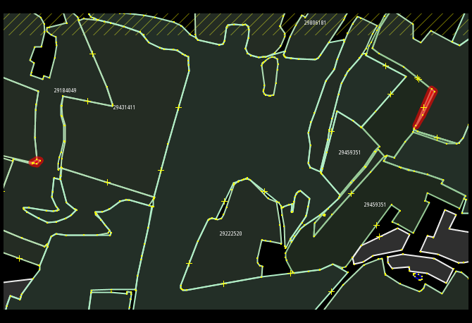
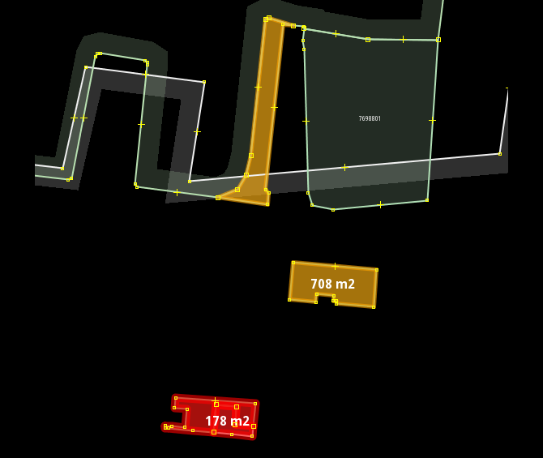

# JOSM-styles

## HOTOSM: tasks.mapcss

Works with downloaded task grid, shows task state


## TALK-CZ

### Tasks (taskman): crtasks.mapcss


Task id insert -> json:
```bash
curl http://taskman.poloha.net/project/{taskNr}/tasks.json | sed 's/\(id["]: *\)\([0-9]\+\)\(,\s\+[^{]*[{]\)/\1\2\3\"task\"\: \2, /g' > tasks.json
```
_TODO: strip leftover code from HOTOSM tasks_
<br>

### Landuse fragments: areasize.mapcss




Colour warnings according to area size:

* red - < 25 m2
* red opaque - < 700 m2
* orange - < 1.000 m2

_Not adjusted for zoom level_